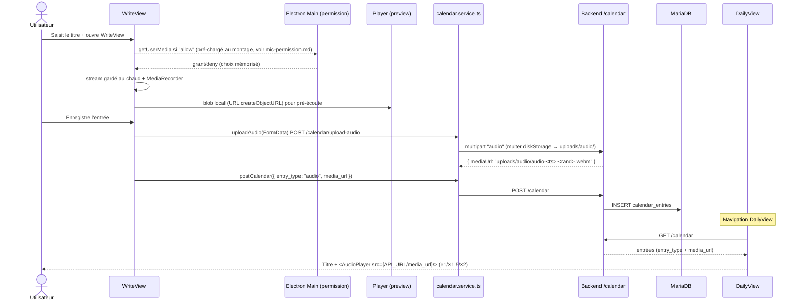

# Notes Vocales (Audio Notes)

> Feature doc — objectifs, événements et pensées enregistrés en audio.

## Vue d'ensemble

Permet de créer des entrées du **Planner** (Goal / Event / Thought) sous forme de
notes vocales : le champ texte sert de **titre**, et un enregistrement audio est
joint à l'entrée. La vue quotidienne affiche alors le titre + un petit lecteur
avec contrôle de vitesse **×1, ×1.5, ×2**.

## Flux de données

## Modèle de données

Colonnes existantes de `calendar_entries` (`init.sql`) :

| Colonne      | Type         | Usage                                    |
| ------------ | ------------ | ---------------------------------------- |
| `text`       | `text`       | Titre de la note vocale                  |
| `entry_type` | `enum('text','audio')` | Type d'entrée                 |
| `media_url`  | `varchar(255)` | Chemin relatif du fichier, ex. `uploads/audio/...` |

## Backend

### Upload (`backend/src/routes/calendar.ts`)

- **Fichiers :** `multer.diskStorage` → `uploads/audio/`, nom `audio-<ts>-<rand><ext>`.
- **Limite :** `fileSize: 25 MB`.
- **Endpoint :** `POST /calendar/upload-audio` (auth requis) → `{ mediaUrl }`.
- **Static :** servi automatiquement via `app.use("/uploads", express.static("uploads"))`
  dans `backend/src/index.ts` → `{API_URL}/uploads/audio/...`.

### Nettoyage des fichiers orphelins

`deleteAudioFile(mediaUrl)` supprime le fichier audio seulement s'il commence par
`uploads/audio/` (protection IDOR / faux positifs) :

- à la **suppression** d'une entrée (`DELETE /calendar/:id`) ;
- au **changement** de `media_url` (`PATCH /calendar/:id`).

Le dossier `uploads/audio/` est créé dans l'image (`backend/Dockerfile`) et sur
l'hôte (bind mount `./backend/uploads`).

## Frontend

### Enregistrement (`WriteView.tsx`)

- Micro pré-chargé **au montage uniquement si `micPermission === "allow"`** (démarrage
  instantané, stream conservé entre les enregistrements) ; en mode `ask` le stream est
  libéré après chaque arrêt → le clic 🎙️ redemande l'autorisation à chaque fois ;
  l'autorisation passe par le `setPermissionRequestHandler` d'Electron
  (`micPermission` ask/allow/deny) — voir `docs/mic-permission.md`.
- `MediaRecorder` sur le stream chaud ; pré-écoute via
  `URL.createObjectURL(blob)` réutilisant `<AudioPlayer>`.
- À la sauvegarde, le blob est uploadé en premier, puis l'entrée est créée avec
  `entry_type: "audio"` et `media_url`.
- En cas d'échec micro / upload → modal d'erreur i18n.
- L'ObjectURL est révoqué à la suppression de l'enregistrement / démontage.

### Lecteur (`AudioPlayer.tsx`)

- Composant réutilisable (`compact` pour planner + post-its et pré-écoute).
- Bouton play/pause, barre de progression, temps, **vitesse cyclique ×1 → ×1.5 → ×2**
  (`playbackRate` appliqué via ref).
- Résout l'URL : `blob:…`/`http…` utilisé tel quel, sinon préfixe `API_URL`.

### Affichage (`DailyView.tsx`)

- Entrées `category` goal/event : lecteur sous le titre si `entry_type === "audio"`.
- Pensées (post-its) : lecteur intégré dans le contenu du post-it.

### i18n

Clés ajoutées au bloc `write` dans **les 7** fichiers `locales/*.json` :
`audioRecord`, `audioStop`, `audioRemove`, `audioErrorTitle`, `audioErrorMsg`,
`audioUploading`.

### CSP

`media-src 'self' blob: https://api-zatyshok.esiah.dev http://localhost:3000`
ajoutée dans `frontend/src/renderer/index.html` (lecture des blobs + fichiers distant).

## Notes / limitations

- Format d'enregistrement : WebM/Opus (Chromium). La durée max est bornée par la
  limite de 25 MB du backend.
- Une note vocale nécessite un **titre** (champ texte de l'entrée classique).
- Les entrées audio ne passent pas encore par le widget calendrier mensuel
  (seul le titre y est affiché) — comportement inchangé.