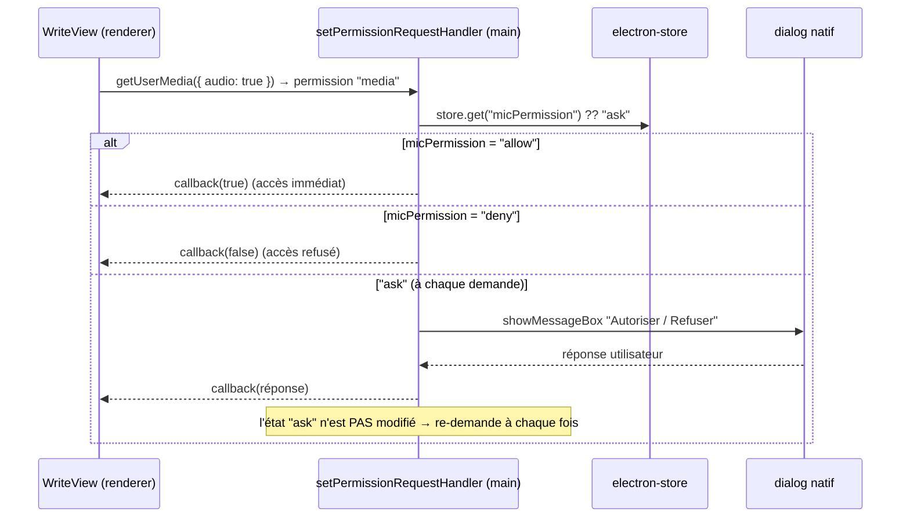

# Permission micro (Electron)

> Feature doc — autorisation micro **explicite**, au comportement configurable
> (`allow`/`deny`/`ask`) et choisie depuis Profil.

## Contexte

Par défaut, Electron **accorde automatiquement** les demandes de permission :
`navigator.mediaDevices.getUserMedia` réussissait sans aucun prompt, rendant le refus
ou le contrôle de l'accès micro impossible depuis l'app.

`frontend/src/main/index.ts` enregistre désormais deux handlers sur la session par
défaut (`setPermissionRequestHandler` + `setPermissionCheckHandler`) : la permission
`media` passe par le réglage `micPermission` (electron-store : `ask` / `allow` / `deny`),
les autres permissions gardent le comportement par défaut (`callback(true)`).

## Sémantique de `micPermission`

| Valeur  | Comportement                                                     |
| ------- | --------------------------------------------------------------- |
| `allow` | Accès micro accordé en silence, immédiatement (pré-chargé).      |
| `deny`  | Accès refusé immédiatement ; le clic 🎙️ affiche une modale d'erreur. |
| `ask`   | Dialogue natif « Autoriser / Refuser » **à chaque** demande → **à chaque enregistrement**. |

Le réglage est modifiable à tout moment dans **ProfileView** (section « Accès au
micro ») : boutons `Demander` / `Autoriser` / `Refuser` → `setStoreValue('micPermission', ...)`.

## Flux de décision

## Points clés

- **`micPermission`** : clé electron-store, valeur `ask` | `allow` | `deny` (défaut `ask`).
- Deux handlers sur la session par défaut :
  - `setPermissionRequestHandler` → décide des demandes `media` ;
  - `setPermissionCheckHandler` → réponse synchrone aux *checks* `media`
    (retourne `false` si `deny`, `true` sinon) pour un blocage cohérent.
- Toute permission ≠ `media` → `callback(true)` (comportement antérieur conservé).
- En mode `ask`, le dialogue réapparaît à **chaque** nouvelle demande `getUserMedia`
  (pas de mémorisation automatique de la réponse).
- **Debug** : des logs `[PERMISSION] ...` sont émis dans le terminal du processus
  principal (dev) à chaque check/demande/réponse — permet de confirmer que le handler tourne.

## Interaction avec WriteView

- Le pré-chargement du micro (`getUserMedia` **au montage**) n'a lieu que si
  `micPermission === "allow"` → démarrage instantané au clic 🎙️, sans dialogue.
- En mode `allow`, le stream est **conservé** entre les enregistrements.
- En mode `ask`, le stream est **libéré à chaque arrêt** (`onstop` → tracks stoppées) :
  chaque clic 🎙️ redemande donc l'autorisation (dialogue natif).
- En mode `deny`, le clic 🎙️ → `getUserMedia` refusé → modale i18n `write.audioErrorMsg`.

## i18n

Clés ajoutées au bloc `profile` dans **les 7** fichiers `locales/*.json` :
`micPermissionTitle`, `micPermissionHint`, `micAsk`, `micAllow`, `micDeny`.