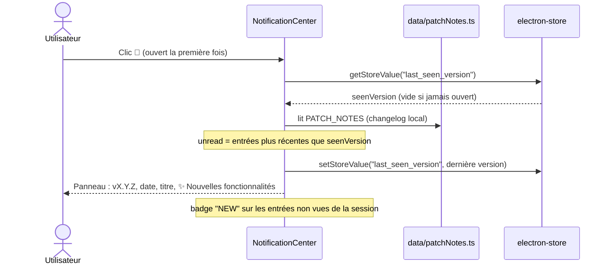

# Centre de notifications (Patch Notes)

> Feature doc — affiche les notes de version / nouveautés depuis un changelog local.

## Vue d'ensemble

Un bouton **cloche 🔔** dans la barre de navigation (`nav-right`, à côté du profil)
ouvre un panneau latéral « Nouveautés » listant les **patch notes** de l'application
(versions, dates, titres et listes de fonctionnalités).

La source est un **changelog local** (`frontend/src/renderer/src/data/patchNotes.ts`),
embarqué avec l'app : la récupération fonctionne **hors-ligne** et ne dépend d'aucune API.

## Flux de données

## Changelog local (`data/patchNotes.ts`)

- Format d'une entrée :

  | Champ      | Description                                      |
  | ---------- | ------------------------------------------------ |
  | `version`  | SemVer, ex. `2.1.0`                              |
  | `date`     | Date de la sortie, ex. `2026-09-24`              |
  | `title`    | Titre de la version                              |
  | `features` | Liste des nouvelles fonctionnalités              |

- **Ajouter une entrée** : insérer un objet **en tête** du tableau `PATCH_NOTES`
  (le plus récent en premier).
- Comparaison sémantique via `isVersionNewer(a, b)` (3 segments numériques) —
  pas de comparaison lexicographique de chaînes.

## Marque « vu / non lu »

- Clé electron-store : `last_seen_version`.
- **Non lu** : toute entrée plus récente que `last_seen_version` (ou *toutes* les
  entrées si la clé n'existe pas encore).
- Au clic sur 🔔 : la **dernière** version du changelog est marquée comme vue ;
  les badges `NEW` restent affichés **pendant la session ouverte**, puis le point
  rouge 🔴 disparaît à la fermeture.

## i18n

Clés ajoutées au bloc `notif` dans **les 7** fichiers `locales/*.json` :
`title`, `new`, `empty`.

## Notes / limitations

- Le contenu des patch notes est une **donnée** (en français), pas une chaîne UI.
  Les libellés du panneau (titre, badge, état vide) sont traduits via les locales.
- Si `PATCH_NOTES` est vide, le panneau affiche `notif.empty`.